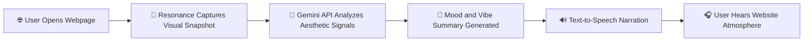

# Project Resonance

## Hear the Web. Feel the Vibe. 🎧✨

Project Resonance is an innovative Chrome extension that transforms webpage aesthetics into immersive spoken narratives.

By combining visual capture, Gemini-powered mood interpretation, and Text-to-Speech output, Resonance helps users understand the emotional tone of any webpage without relying only on sight.

> 🚀 Resonance bridges sight and sound to create an expressive, accessible, and hands-free browsing experience.

---

## 📌 Quick Links

- [Why Resonance](#-why-resonance)
- [Core Features](#-core-features)
- [How It Works](#-how-it-works)
- [Tech Stack](#-tech-stack)
- [Setup](#-local-setup)
- [Roadmap](#-roadmap)
- [Team](#-team)

---

## 🌈 Why Resonance

Websites already communicate emotions through color, typography, spacing, and imagery.
Resonance converts those silent visual signals into an audible "vibe" so users can instantly sense the atmosphere of a page.

### 💡 What users gain

- Instant mood understanding before deep reading
- Hands-free context while multitasking
- More accessible browsing for low-vision users
- A fresh, interactive way to experience design and content

---

## ⚙️ Core Features

### 1. 📸 Visual Context Capture
- Captures relevant webpage imagery and UI composition
- Works on the active tab for real-time vibe extraction

### 2. 🧠 Gemini Vibe Analysis
- Sends visual context to Gemini API
- Interprets tone and style: calm, energetic, playful, premium, minimal, dramatic, and more

### 3. 🔊 Spoken Narration (TTS)
- Converts AI summary into natural spoken output
- Delivers a concise audio description of page atmosphere

### 4. ♿ Accessibility-First Experience
- Supports audio-first and low-vision browsing flows
- Makes emotional web context easier to consume

---

## 🧭 How It Works

---

## 🎯 Use Cases

- Quick vibe check before diving into content
- Accessibility-friendly browsing companion
- Creative inspiration for designers and content teams
- Context-aware navigation while working on other tasks

---

## 🛠 Tech Stack

- Chrome Extension APIs
- Gemini API (Generative AI mood extraction)
- Text-to-Speech engine
- JavaScript / TypeScript
- HTML / CSS for popup and controls

---

## 🚀 Local Setup

1. Clone this repository.
2. Configure API keys in your local environment/config.
3. Open Chrome and navigate to `chrome://extensions`.
4. Enable Developer Mode.
5. Click "Load unpacked" and select this project folder.
6. Open any webpage and trigger Resonance.

---

## 🧪 Demo Vibe Output

> "This page feels sleek and confident, with cool tones and clean spacing. The vibe is modern, focused, and premium with a calm professional energy."

<strong>🎤 Sample Prompt Sent to Gemini</strong>

Analyze this webpage screenshot and describe the overall emotional vibe in 2-3 lines. Focus on color psychology, layout energy, and design tone.

---

## 🗺 Roadmap

- [ ] Multi-language narration
- [ ] Voice style selector (calm / energetic / neutral)
- [ ] Emotion intensity slider
- [ ] Context memory across tabs
- [ ] Ambient background sound matching mood profile

---

## 👥 Team

Built with passion at Hackdays by:

1. **🌟 Vadanta Kumar Chauhaan**
2. **🌟 Mayank Kumar**
3. **🌟 Mehak Gupta**
4. **🌟 Kanishq Attreya**

---

## 🏁 Vision Statement

_Resonance reimagines web browsing as an emotional, multisensory journey._

_Every page has a feeling, and with Resonance, every feeling can be heard._ 🌍🎵

> _From pixels to pulse, Resonance lets you hear what the web feels like._

